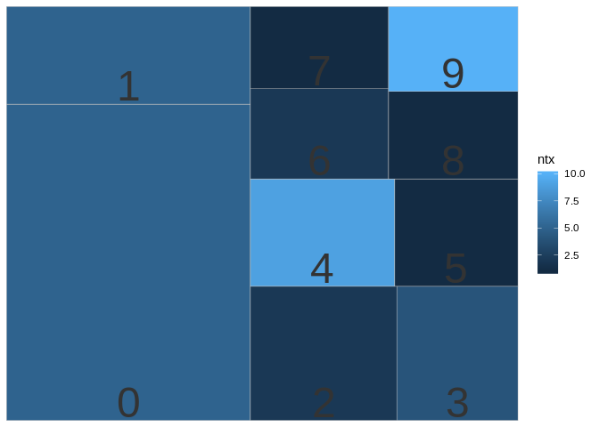
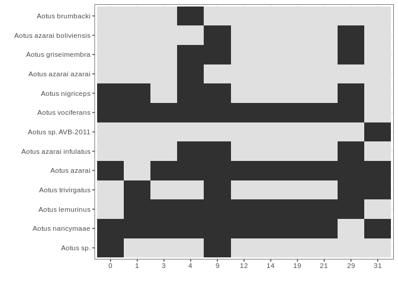

`phylotaR` Introduction
=======================

The `phylotaR` package downloads all sequences associeted with a given taxonomic group and then runs all-vs-all BLAST to identify clusters of sequences suitable for phylogenetic analysis.

The process takes place across four stages:

-   Taxise: identify taxonomic IDs
-   Download: download sequences
-   Cluster: run all-vs-all BLAST
-   Cluser^2: run all-vs-all BLAST again

Setup
=====

To run `phylotaR`, we need to set up a folder to host all downloaded files. Parameters for setting up the folder are provided to the `setup` function.

``` r
# NOT RUN
library(phylotaR)
# available parameters
print(parameters())
# e.g. mnsql = 200 - minimum sequence length
# pass the parameters to the setup() function
# essential parmeters are: wd, txid
wd <- file.path(tempdir(), 'testing_phylotaR')
if (dir.exists(wd)) {
  unlink(x = wd, recursive = TRUE, force = TRUE)
}
dir.create(wd)
setup(wd = wd, txid = '9504', outsider = TRUE, v = TRUE)
# to run the pipeline
# run(wd = wd)
```

Parsing results
---------------

Read in the phylotaR results with `read_phylota`. But here we will use the pacakge example data, "Aotus".

### Summarise the clusters

``` r
library(phylotaR)
data(aotus)
# generate summary stats for each cluster
smmry_tbl <- summary(aotus)
# Important details
#  N_taxa     - number of taxonomic entities associated with sequences in cluster
#  N_seqs     - number of sequences in cluster
#  Med_sql    - median sequence length of sequences in cluster
#  MAD        - measure of the deviation in sequence length of a cluster
#  Definition - must common words in sequence definition lines
smmry_tbl[1:10, ]
#>    ID    Type               Seed Parent N_taxa N_seqs Med_sql       MAD
#> 1   0 subtree         AF129794.1   9504      5    204     267 0.7124669
#> 2   1 subtree           U52114.1   9504      5     63    1020 0.7604098
#> 3   2 subtree         DI178118.1   9504      2     52     267 0.8666904
#> 4   3 subtree         JQ932794.1   9504      4     43     568 0.6643121
#> 5   4 subtree           U36844.1   9504      9     41     549 0.8397112
#> 6   5 subtree KF014117.1/1..1263   9504      1     35    1281 0.7731248
#> 7   6 subtree         LC075891.1   9504      2     33     838 0.8026216
#> 8   7 subtree         JN161069.1   9504      1     30    1088 0.9985614
#> 9   8 subtree         JN161069.1  30591      1     30    1088 0.9985614
#> 10  9 subtree         AJ489745.1   9504     10     29    1140 1.0000000
#>                           Definition                      Feature
#> 1       aotus (0.07), partial (0.07) aovodrb (0.5), aonadrb (0.5)
#> 2         aotus (0.09), class (0.09)                     mhcf (1)
#> 3  antibody (0.05), construct (0.05)           jp (0.3), kr (0.2)
#> 4         aotus (0.2), genomic (0.2)                            -
#> 5    gene (0.1), mitochondrial (0.1)                     coii (1)
#> 6        allele (0.08), aotus (0.08) kir3ds3 (0.2), kir2ds5 (0.1)
#> 7             dna (0.1), aotus (0.1)                            -
#> 8          azarai (0.2), aotus (0.1)                            -
#> 9          azarai (0.2), aotus (0.1)                            -
#> 10     aotus (0.1), cytochrome (0.1) cytb (0.4), cytochrome (0.3)
# plot
p <- plot_phylota_treemap(phylota = aotus, cids = aotus@cids[1:10],
                          area = 'nsq', fill = 'ntx')
#> Registered S3 methods overwritten by 'ggplot2':
#>   method         from 
#>   [.quosures     rlang
#>   c.quosures     rlang
#>   print.quosures rlang
print(p)
```



### Understand the PhyLoTa table (`aotus`)

``` r
# PhyLoTa table has ...
# clusters
aotus@clstrs
#> Archive of cluster record(s)
#>  - [193] clusters
# sequences
aotus@sqs
#> Archive of sequence record(s)
#>  - [1499] sequences
#>  - [13] unique txids
#>  - [548] median sequence length
#>  - [0] median ambiguous nucleotides
# taxonomy
aotus@txdct
#> Taxonomic dictionary [21] recs, parent [id 9504]

# A cluster is a list of sequences
aotus@clstrs@clstrs[[1]]
#> Cluster Record [id 0]
#>  - [subtree] type
#>  - [AF129794.1] seed sequence
#>  - [204] sequences
#>  - [5] taxa
str(aotus@clstrs@clstrs[[1]])
#> Formal class 'ClstrRec' [package "phylotaR"] with 8 slots
#>   ..@ id   : int 0
#>   ..@ sids : chr [1:204] "AF129792.1" "AF129793.1" "AF129794.1" "AF129795.1" ...
#>   ..@ nsqs : int 204
#>   ..@ txids: chr [1:204] "231953" "231953" "231953" "231953" ...
#>   ..@ ntx  : int 5
#>   ..@ typ  : chr "subtree"
#>   ..@ prnt : chr "9504"
#>   ..@ seed : chr "AF129794.1"
# A sequence is a series of letters and associated metadata
aotus@sqs@sqs[[1]]
#> SeqRec [ID: FJ623078.1]
str(aotus@sqs@sqs[[1]])
#> Formal class 'SeqRec' [package "phylotaR"] with 16 slots
#>   ..@ id     : chr "FJ623078.1"
#>   ..@ nm     : chr ""
#>   ..@ accssn : chr "FJ623078"
#>   ..@ vrsn   : chr "FJ623078.1"
#>   ..@ url    : chr "https://www.ncbi.nlm.nih.gov/nuccore/FJ623078.1"
#>   ..@ txid   : chr "37293"
#>   ..@ orgnsm : chr "Aotus nancymaae"
#>   ..@ sq     : raw [1:1374] 61 74 67 67 ...
#>   ..@ dfln   : chr "Aotus nancymaae CD4 antigen (CD4) mRNA, complete cds"
#>   ..@ ml_typ : chr "mRNA"
#>   ..@ rec_typ: chr "whole"
#>   ..@ nncltds: int 1374
#>   ..@ nambgs : int 0
#>   ..@ pambgs : num 0
#>   ..@ gcr    : num 0.447
#>   ..@ age    : int 3412
# A taxonomic record is an ID and associated metadata
txid <- aotus@txids[[1]]

# Information can be extracted from ...
# clusters
get_clstr_slot(phylota = aotus, cid = aotus@cids[1:10], slt_nm = 'nsqs')
#>   0   1   2   3   4   5   6   7   8   9 
#> 204  63  52  43  41  35  33  30  30  29
# sequences
get_sq_slot(phylota = aotus, sid = aotus@sids[1:10], slt_nm = 'nncltds')
#>         FJ623078.1           U38998.1           U88361.1 
#>               1374                525                465 
#>         AY684995.1         AY684994.1         AY684993.1 
#>                954               1425               1389 
#> AY684992.1/1..1422  AY684991.1/1..975           U88362.1 
#>               1422                975                465 
#>           U88363.1 
#>                465
# tax. records
get_tx_slot(phylota = aotus, txid = aotus@txids[1:10], slt_nm = 'scnm')
#>                      37293                       9505 
#>          "Aotus nancymaae"        "Aotus trivirgatus" 
#>                      57176                      57175 
#>         "Aotus vociferans"          "Aotus nigriceps" 
#>                      43147                     231953 
#>          "Aotus lemurinus"                "Aotus sp." 
#>                      30591                     280755 
#>             "Aotus azarai" "Aotus azarai boliviensis" 
#>                     867331                     292213 
#>   "Aotus azarai infulatus"       "Aotus griseimembra"

# Other useful convenience functions
get_nsqs(phylota = aotus, cid = aotus@cids[1:10])
#>   0   1   2   3   4   5   6   7   8   9 
#> 204  63  52  43  41  35  33  30  30  29
get_ntaxa(phylota = aotus, cid = aotus@cids[1:10], rnk = 'species')
#> 0 1 2 3 4 5 6 7 8 9 
#> 5 5 2 4 7 1 2 1 1 8
```

### Select clusters

``` r
# use the summary table to extract cids of interest
nrow(smmry_tbl)
#> [1] 193
# keep clusters with MAD above 0.5
smmry_tbl <- smmry_tbl[smmry_tbl[['MAD']] >= 0.5, ]
nrow(smmry_tbl)
#> [1] 193
# keep clusters with more than 10 seqs
smmry_tbl <- smmry_tbl[smmry_tbl[['N_seqs']] >= 10, ]
nrow(smmry_tbl)
#> [1] 33
# keep clusters with more than 4 species
nspp <- get_ntaxa(phylota = aotus, cid = smmry_tbl[['ID']], rnk = 'species')
selected_cids <- smmry_tbl[['ID']][nspp >= 4]
length(selected_cids)
#> [1] 11

# create selected PhyLoTa table
selected_clusters <- drop_clstrs(phylota = aotus, cid = selected_cids)
```

### Plotting selected clusters

``` r
# extract scientific names for taxonomic IDs
scnms <- get_tx_slot(phylota = selected_clusters, txid = selected_clusters@txids,
                     slt_nm = 'scnm')
# plot presence/absence
plot_phylota_pa(phylota = selected_clusters, cids = selected_clusters@cids,
                txids = selected_clusters@txids, txnms = scnms)
```



### Writing to file

``` r
# reduce clusters to repr. of 1 seq. per sp.
reduced_clusters <- drop_by_rank(phylota = selected_clusters, rnk = 'species',
                                 n = 1)
reduced_clusters
#> Phylota Table (Aotus)
#> - [11] clusters
#> - [63] sequences
#> - [11] source taxa
# write out first cluster
sids <- reduced_clusters@clstrs[['0']]@sids
txids <- get_txids(phylota = reduced_clusters, sid = sids, rnk = 'species')
scnms <- get_tx_slot(phylota = reduced_clusters, txid = txids, slt_nm = 'scnm')
outfile <- file.path(tempdir(), 'cluster_1.fasta')
write_sqs(phylota = reduced_clusters, sid = sids, sq_nm = scnms,
          outfile = outfile)
cat(readLines(outfile), sep = '\n')
#> >Aotus nancymaae
#> cgtttcttgttccagactacgtctgagtgtcatttcttcaacgggacggagcgggtgcggttcctggacagatacttcta
#> taaccaggaggagtatgtgcgcttcgacagcgacgtgggggagtaccgggcggtgacggagctggggcggcggagcgcag
#> agtactggaacagccagaaggacttcctggaggagaggcgggccttggtggacacctactgtagatacaactacggggtt
#> gctgagagcttcacagtgcagcggcgaa
#> 
#> >Aotus nigriceps
#> cgtttcttgttccagactacgtctgagtgttatttcttcaacgggacggagcgggtgcggtacctggacagatactttta
#> taaccaggaggaatatgtgcgcttcgacagcgacgtgggggagtaccgggcggtgacggagctggggcggcctgacgccg
#> agtactggaacagccagaaggactacgtggagcggaagcggggccaggtggacaactactgcagacacaactacggggtt
#> ggtgagagcttcacagtgcagcggcgaa
#> 
#> >Aotus sp.
#> ctcgtttcttggagcaggctaagtatgagtgtcatttcctcaacgggacggagcgggtgcggttcctggaaagacacatc
#> cataaccaggaggagtatgcgcgcttcgacagcgacgtgggggagtaccgggcggtgacggagctggggcggcggaccgc
#> agagtactggaacagccagaaggacatcctggaggacaggcgggcccaggtggacaccgtgtgcagacacaactacgggg
#> ttggtgagagcttcacagtgcagcggaga
#> 
#> >Aotus azarai
#> ttggagctggttaagcatgagtgtcatttcttcaacgggacggagcgggtgcggtacctggacagatacctttataacca
#> gaaggagtatgtgcgcttcgacagcgacgtgggggagtaccgggcggtgacggagctggggcggcctgacgccgagtact
#> ggaacagccagaaggactacgtggagcagaagcggggccaagtggacaactactgcagacacaactacggggtttttgag
#> agcttcacagtg
#> 
#> >Aotus vociferans
#> cgtttcttggagcagtttaagcctgaatgtcatttcttcaacgggacggagcgggtgcggttcctggacagatacttcta
#> taaccaggaggagtatgtgcgcttcgacagcgacgtgggggagtaccgggcggtgacggagctggggcggcctgacgccg
#> agtactttaacagcctgaaggacttcatggaggagacgcgggccgcggtggacacctactgcagacacaactacggggtt
#> gttgagagcttcaca
```

------------------------------------------------------------------------

Exercise
========

-   Download rodent `phylotaR` results found [here](https://drive.google.com/uc?export=download&id=1kUCKsLflUistf7ZnBKCsWZeh269u5ec1).
-   Read in the `phylotaR` results
-   Reduce to clusters of MAD scores &gt; 0.5 and &gt; 20 taxa
-   Reduce clusters to represent just 1 sequence per species
-   Write out sequences as `.fasta` with species names
